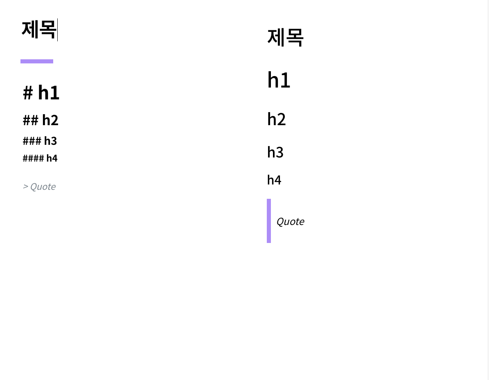

# 마크다운 뷰어

velog.io의 '새 글 작성' 펭지의 마크다운 뷰어 부분을 클론코딩 해봤습니다.  
완벽하게 구현된 상태는 아닙니다.(능력부족;;)  
CodeMirror로 구현한 왼쪽창에 입력하면, 오른쪽 Preview에 marked를 통해 마크다운으로 파싱하게 됩니다.  
혼자서 생각해보면서 구현해보면서 CodeMirror, marked 같은 라이브러리를 충분히 이해하고 사용하기가 어려웠지만  
계속해서 기능들을 찾아보고, 구현해보면서 '진짜로' 사용하는 방법에 대해 배운 것 같습니다.  
(나중에 꼭 리팩토링 할겁니다.)

### 기술스택

- React
- react-redux
- styled-components
- CodeMirror
- marked
- font: Google Font - Noto Sans KR

### Licence

- font : google font - open Font Licence
- marked : MIT
